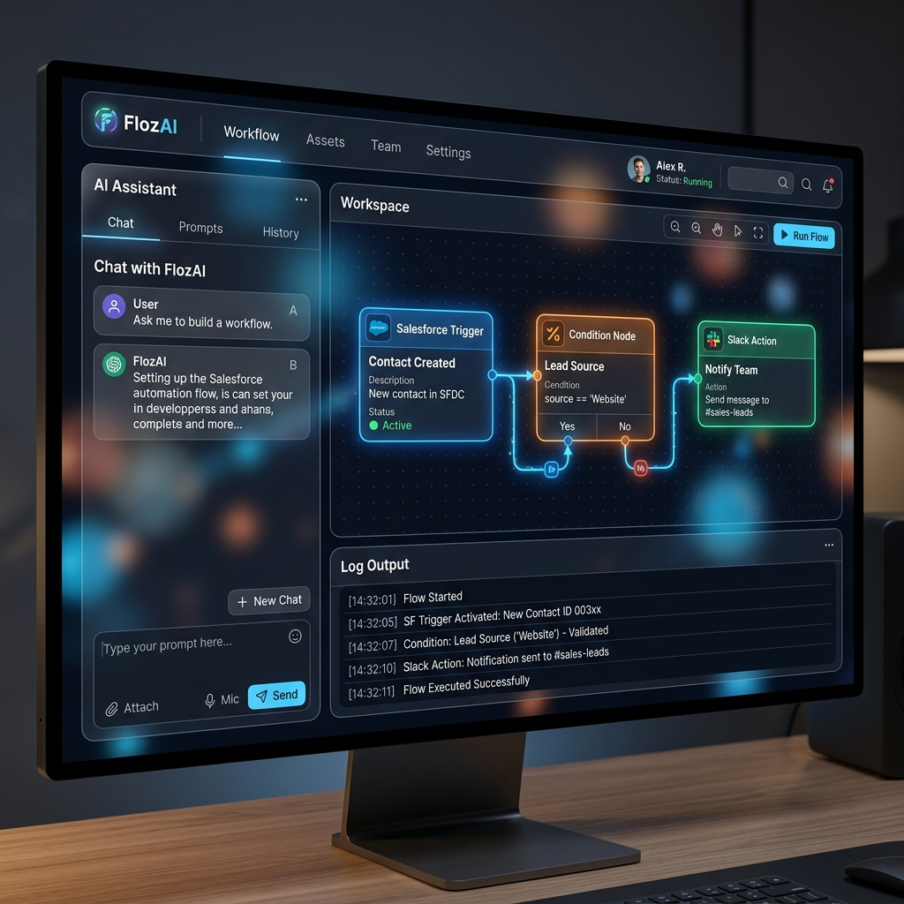

# 🚀 FlozAI: AI-Driven Workflow Automation Platform

FlozAI is a premium, multi-tenant AI reasoning layer for workflow automation (Zapier/Make alternative). Instead of manually building trigger-action chains, users can describe their goals in natural language. FlozAI parses the intent, validates it against real-world schemas, generates an interactive workspace canvas, and executes workflows.

---

## 📸 Screenshots

*Below is a visual overview of the FlozAI system interface:*




---

## 🌟 Key Features

* **AI-Powered Intent Parser:** Parses complex workflow requests into structured triggers, actions, and conditions using a token-saving **2-call LLM classification pipeline** (Llama 3.3).
* **Interactive React Flow Canvas:** Draggable, connectable, and editable nodes rendering full workflow state, complete with real-time payload debugging tooltips.
* **Supabase Cloud Synchronization:** Fully database-backed multi-tenant system using Supabase Auth (JWT) and PostgreSQL database tables protected by Row-Level Security (RLS) policies.
* **15+ Brand Integrations:** Ready-to-use schemas for HubSpot, Salesforce, Slack, Gmail, Stripe, Notion, Airtable, OpenAI, and more.
* **Database-Backed Integration Credentials:** Secure credential management saved to PostgreSQL `integrations` rather than server files.
* **Docker-Ready:** Standard Dockerfile and docker-compose configurations for instant local scaling.

---

## 🛠️ Tech Stack

* **Frontend:** Vite, React 18, `@xyflow/react` (React Flow), Lucide Icons, Vanilla CSS (Glassmorphism & animations).
* **Backend:** FastAPI, Uvicorn, Pydantic v2, Python Dotenv, HTTPRequests.
* **Database/Auth:** Supabase Auth (JWT), PostgreSQL with RLS.
* **Inference:** Groq SDK (Llama 3.3).

---

## 📁 Folder Structure

```
flozAI/
├── config/                 # Service-level configuration files
├── docs/                   # DB Schemas & Architecture guides
├── frontend/               # Vite React SPA
│   ├── public/             # Static public assets
│   ├── src/                # Frontend source code
│   │   ├── components/     # App views & layout components
│   │   ├── hooks/          # React custom hooks
│   │   ├── services/       # Supabase and API clients
│   │   └── styles/         # CSS styles and design tokens
│   ├── package.json        # Frontend dependencies
│   ├── vercel.json         # Vercel SPA configuration
│   └── vite.config.js      # Vite build configuration
├── src/                    # FastAPI Backend Source
│   └── flozai/             # Main python packages
│       ├── api/            # API routing handlers
│       ├── core/           # Intent parser & execution engines
│       ├── prompts/        # LLM system prompts
│       ├── services/       # Supabase database services
│       └── utils/          # Utilities (logging, HTTP, etc.)
├── tests/                  # Integration and unit tests
├── Dockerfile              # Backend production container
├── docker-compose.yml      # Multi-container local environment orchestrator
├── main.py                 # Backend entry point
├── pyproject.toml          # Backend metadata and settings
├── requirements.txt        # Production dependencies
└── README.md               # Project documentation
```

---

## ⚙️ Environment Variables

### Backend Environment Variables (`.env`)

Configure these variables at the root `flozAI/` directory:

```env
# Supabase Configuration
SUPABASE_URL=https://your-project.supabase.co
SUPABASE_KEY=your-anon-key
SUPABASE_SERVICE_ROLE_KEY=your-service-role-key

# LLM API
GROQ_API_KEY=gsk_...

# Environment and logs
ENVIRONMENT=production # or development
LOG_LEVEL=INFO

# OAuth Credentials (optional)
GOOGLE_CLIENT_ID=your-google-client-id
GOOGLE_CLIENT_SECRET=your-google-client-secret
OAUTH_REDIRECT_URI=http://localhost:8000/oauth/callback
```

### Frontend Environment Variables (`frontend/.env.local`)

Configure these variables inside `flozAI/frontend/`:

```env
# Supabase Configuration
VITE_SUPABASE_URL=https://your-project.supabase.co
VITE_SUPABASE_ANON_KEY=your-anon-key

# API Base URL
VITE_API_URL=https://your-backend-api.com
```

---

## 🚀 Installation & Local Running

### 1. Database Setup (Supabase)
1. Create a free project at [supabase.com](https://supabase.com).
2. Go to **SQL Editor** -> **New Query**.
3. Paste the contents of `docs/database_schema.sql` and click **Run**.
4. Retrieve your `Project URL` and `Anon Key`.

### 2. Run with Docker Compose (Recommended)
Launch the entire stack (Frontend + Backend) with a single command:
```bash
docker-compose up --build
```
Open [http://localhost:5173](http://localhost:5173) in your browser.

### 3. Manual Setup (Alternative)

#### Backend Setup
1. Initialize virtual environment:
   ```bash
   python -m venv venv
   .\venv\Scripts\activate  # Windows
   source venv/bin/activate # Unix
   ```
2. Install dependencies:
   ```bash
   pip install -r requirements.txt
   ```
3. Start FastAPI server:
   ```bash
   python main.py
   ```

#### Frontend Setup
1. Navigate to frontend folder and install:
   ```bash
   cd frontend
   npm install
   ```
2. Run development server:
   ```bash
   npm run dev
   ```

---

## 🌐 Deployment Guide

### Backend Deployment (Docker/PaaS)
The FastAPI backend can be built into a Docker container and deployed to container platforms like Render, AWS ECS, Fly.io, or Google Cloud Run.
```bash
docker build -t flozai-backend .
```

### Frontend Deployment (Vercel)
The Vite React frontend is pre-configured for Vercel deployment.
1. Build check locally:
   ```bash
   npm run build
   ```
2. Deploy using Vercel CLI:
   ```bash
   npx vercel
   ```
3. Ensure you set the `VITE_SUPABASE_URL`, `VITE_SUPABASE_ANON_KEY`, and `VITE_API_URL` environment variables in your Vercel Dashboard.

---

## 📄 License

This project is licensed under the MIT License. See the [LICENSE](LICENSE) file for details.
